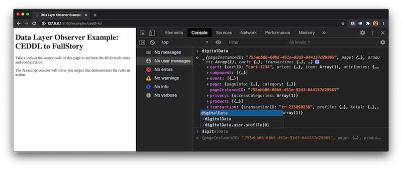
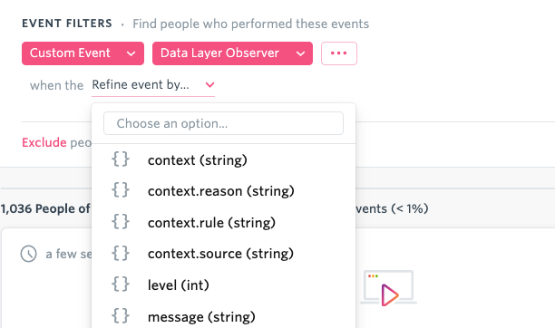

# FullStory Data Layer Observer

[](https://circleci.com/gh/fullstorydev/fullstory-data-layer-observer)

FullStory Data Layer Observer (DLO) is a small but powerful JavaScript utility that makes integrating analytics data easier.  Through a flexible syntax and rules-driven approach, you can reference data from a data layer, perform intermediate changes, and send the result to FullStory - all without writing any custom JavaScript.

**Data Layer Observer is currently in a private beta.**

## Quick Start

### Snippet

Add Data Layer Observer to your web site or web app by including the following snippet.

```html
<script>
 window['_dlo_appender'] = 'fullstory';
 window['_dlo_beforeDestination'] = { name: 'suffix' };
 window['_dlo_previewMode'] = true;   // false in production
 window['_dlo_readOnLoad'] = true;    // see docs on usage
 window['_dlo_validateRules'] = true;
 window['_dlo_rules'] = [{
  // add your rules here
 }];
 </script>
```

### Examples

The examples folder has a variety of samples of Data Layer Observer in action. To run examples locally, install [node.js](https://nodejs.org/) and perform the following after cloning or downloading this repo.

```bash
cd fullstory-data-layer-observer/
npm install # do this only the first time
npm run examples
```

Then open your browser to `http://127.0.0.1:8080/examples`. You can experiment with adjusting the rules or the data in the `index.html` files and watch the output in your browser.

## Viewing a Data Layer

Before using DLO, it’s important to understand what’s in your data layer.  This can be as simple as visiting a web page in a browser like Chrome and opening the [JavaScript Console](https://developers.google.com/web/tools/chrome-devtools/console#javascript) (`option` + `cmd` + `j`).  Try typing `digitalData` or `dataLayer` or `s` in the text field next to the caret and hit `return`.  If something is printed that does not look like an error, that’s the data layer.  You can click the small triangle twistie to further explore what’s in the data layer.



More sophisticated websites will often have a dictionary of what’s in a data layer and the meaning of the data.  Always consult your analytics team before using data found in a data layer.

## Data Privacy

Sensitive, private, and confidential information should never be added to a data layer.  Various 3rd party libraries reside on most websites and have access to such information.  DLO uses the following approaches to additionally prevent unwanted data from being transmitted.

- A rule-based design requires an admin to be intentional about data recording.  An admin must create and load a rule to collect any information from a data layer.  Recording is not automatic.
- Despite being intentional, it’s possible that domain teams may later add unwanted properties to a previously approved object in the data layer.  DLO’s selector syntax allows an admin to specify which properties within an object are included or omitted as well as filtering techniques to further prevent recording unwanted data.

## Deployment

**Private beta customers should work directly with FullStory to obtain access to the script.**

DLO is a JavaScript asset that is included on a web page.  FullStory hosts versions of DLO on our CDN.  Versioned releases have the naming convention `dlo-<version>.js`, and the most recent version is named `dlo-latest.js`.  If you would like the most up to date version of DLO on your site always, use `dlo-latest.js`.  If you'd rather use stable releases and perform manual upgrades, use `dlo-<version>.js`.  See the [CHANGELOG](./CHANGELOG.md) for features and fixes.

To include DLO on a webpage, simply add the script to source code or load the script dynamically using a tag manager.  The DLO asset should be loaded after the [FullStory recording snippet](https://help.fullstory.com/hc/en-us/articles/360020623514-How-do-I-get-FullStory-up-and-running-on-my-site-) has been added to the page.

If you would prefer to self-host the asset, use the `npm run build` command to create `dlo.js` and `dlo.min.js` files.  The latter is a minified script suitable for production.  You should also gzip compress the asset and set appropriate `Cache-Control` headers when self-hosting.

FullStory’s hosted asset is less than 8KB minified, compressed and has `Cache-Control` set to one month.

## Configuration

DLO is configurable by adding relevant options as `window` properties to the page prior to loading the script.  The following sample demonstrates a configuration suitable for testing a [CEDDL](https://www.w3.org/2013/12/ceddl-201312.pdf) rule.

```html
<script>
 window['_dlo_beforeDestination'] = { name: 'suffix' };
 window['_dlo_previewMode'] = true;
 window['_dlo_readOnLoad'] = true;
 window['_dlo_validateRules'] = true;
 window['_dlo_rules'] = [{
  id: 'fs-event-ceddl-cart',
  description: 'send CEDDL cart cartID and price properties to FS.event as a "View Cart" event',
  source: 'digitalData.cart[(cartID,price)]',
  operators: [{ name: 'insert', value: 'View Cart' } ],
  destination: 'FS.event'
 }];
 </script>
 ```

Additional configuration can be added using the below options.

| Option | Type | Default | Description |
| ------ | ---- | ------- | ----------- |
| _dlo_appender | LogAppender or string | `console` | Defines a custom log appender to redirect log messages. |
| _dlo_beforeDestination | OperatorOptions | `undefined` | An optional operator that is always used just before before the destination. |
| _dlo_logLevel | number | `1` | Log messages at this level and below will be logged by the LogAppender. Defaults to WARN. |
| _dlo_previewDestination | string | `'console.log'` | Output destination using rule selector syntax for use with previewMode. |
| _dlo_previewMode | boolean | `true` | Redirects output from a destination to previewDestination when testing rules. |
| _dlo_readOnLoad | boolean | `false` | When true reads data layer target(s) and emits the initial value(s). |
| _dlo_rules | array | `[]` | Anything that starts with `_dlo_rules` is read as a rules array. |
| _dlo_validateRules | boolean | `true` | When true validates rules to prevent processing invalid options. |
| _dlo_urlValidator | function | `(url) => boolean` | Function used to validate the page URL before executing the rules. The default tests `window.location.href`. |

## Data Layer Rules

To observe a data layer, DLO uses rules to define what to observe and how to handle data.  A variety of sample rules that are compatible with existing data layers can be found in the [examples/rules](./examples/rules) folder.

A rule is composed of three primary pieces of information:

- `source` targets an object in the data layer using a selector.  The selector can also be used to choose which data in an object is recorded.
- `destination` declares a function, which acts as a destination for data.  The function is an API that already exists on the page - like `FS.event`.
- `operators` provide intermediate transformations of the data between the source and destination.

A rule is expressed as JSON and multiple rules are included in a `_dlo_rules` list.

```javascript
window['_dlo_rules'] = [
 {
  id: 'fs-uservars-ceddl-user-all',
  description: 'send all CEDDL user properties to FS.setUserVars',
  source: 'digitalData.user.profile[0]',
  operators: [ { name: 'flatten' } ],
  destination: 'FS.setUserVars'
},
 {
  id: 'fs-event-ceddl-transaction-id-total',
  description: 'send CEDDL transaction transactionID and total properties to FS.event as an "Order Completed" event',
  source: 'digitalData.transaction[(transactionID,total)]',
  operators: [ { name: 'flatten' }, { name: 'insert', value: 'Order Completed' } ],
  destination: 'FS.event'
 }
];
```

The above sample contains two rules that respectively send all properties in the `digitalData.user.profile` object to the function `FS.setUserVars` and sends specific properties from the `digitalData.transaction` object to the `FS.event` function.  The mechanics of how this is done is explained in the [Operator Tutorial](https://github.com/fullstorydev/fullstory-data-layer-observer/tree/main/docs/operator_tutorial.md) in greater detail.

> **Tip**: While not required, a best practice is to include an `id` in every rule.  The `id` should uniquely identify the rule for troubleshooting purposes.  A `description` is also optional but often helps explain the intent of a rule.

## Rule Options

Each rule provides a set of options for configuration.  Options with an asterisk are required.

| Option | Default | Description |
| ------ | ------- | ----------- |
| `source`* | `undefined` | Data layer source object using selector syntax. |
| `destination`* | `undefined` | Destination function using selector syntax. |
| `debug` | `false` | Set to true if the rule should print debug for each operator transformation. |
| `description` | `undefined` | Text description of the rule. |
| `id` | `undefined` | Unique identifier for the rule. |
| `monitor` | `true` | Set to true to monitor property changes or function calls |
| `operators` | `[]` | List of operators that transform data before a destination. |
| `readOnLoad` | `false` | Rule-specific override for `window[‘_dlo_readOnLoad’]`. |
| `url` | `undefined` | Specifies a regular expression that enables the rule when the page URL matches. |

> **Tip:** Use `url` to limit when data is read from a data layer and enhance performance.

## Data Handling

The configuration option `window['_dlo_readOnLoad'] = true;` can be used on static data layers, which should exist on the page prior to loading DLO.  Many data layers are however dynamic: values change as the user interacts with the page.  By default, DLO will attempt to monitor for changes to a data layer's object or any property within an object.  An observed change will cause the data to be handled.  Functions can be observed as well (e.g. `trackEvent()`).  When functions are called, the arguments passed to the function will be provided to data handlers.

## Source Selection

As mentioned, `source` is an important aspect of a rule: it defines which data layer subject to observe or read an initial value from.  A `source` can be a JavaScript object with name value pairs (`digitalData.user`) or a function (`s.event`).

The `source` property uses a custom selector syntax.  It’s most often seen as dot notation such as `digitalData.cart`, which can be read as, "Find the cart object inside the digitalData object that exists on the page."  Selector syntax is however much more expressive to allow a variety of common use cases.

| Selector | Example | Description |
| -------- | ------ | ----------- |
| parent.child.grandchild | `digitalData.user` | Returns the last object from dot notation. |
| object[index] | `digitalData.product[-1]` | Returns the object at `index` (a negative index steps back from the end, so -1 is the last item in an array). |
| object[(property, ...)] | `digitalData.cart[(cartID,price)]` | Returns an object with only the listed properties. |
| object[!(property, ...)] | `digitalData.page.pageInfo[!(destinationURL,referringURL)]` | Returns an object with the listed properties removed. |
| object[^(property, ...)] | `digitalData.cart.price[^(shipping)]` | Returns an object with properties whose names begin with `property`. |
| object[$(property, ...)] | `digitalData.page.pageInfo[$(Date)]` | Returns an object with properties whose names end with `property`. |
| object[?(property, ...)] | `digitalData.cart[?(cartID)]` | Returns the object or null if the object does not have property. |
| object[?(property=value, ...)] | `digitalData.cart.price[?(basePrice>=10)]` | Returns the object or null if the object's `property` does not compare to `value`. Comparison can be `=`, `<=`, `>=`, `<`, `>`, `!=`, `!^`, and `=^`. |

Selector syntax can be combined to create sophisticated queries to the data layer.  For example, `digitalData.products[-1].attributes.availability[?(pickup)]` can be read as, "From the products list, return the last product's availability if it has the `pickup` property."  This usage of selection can be helpful to record only significant events and disregard others.

> **Tip:** A selector returns the most current subject from the data layer at the lowest level. For example, `digitalData.cart.price[?(basePrice>=10)]` returns the `price` object - not `cart`. If you need `cart` returned, use `digitalData.cart` as the selector and the use the query operator.

## Destination Selection

For every `source` there must also be a `destination`.  A `destination` is a JavaScript function that is located using selector syntax.  (Though it’s often less expressive since dot notation is usually enough to find the function.)  A simple example of a destination is `console.log`, which would print the output of a data layer to the console.

Because `destination` is a function, this gives DLO a very flexible way to hand off data to a third party.  You can think of this hand off as DLO calling a specific JavaScript function with arguments.  The arguments are the data emitted from the data layer and anything added by `operators`.  In the simple `console.log` destination example, the object taken from the data layer would call `console.log(object)`, which would simply print the object on the console.

A more practical example is calling FullStory’s [event](https://developer.fullstory.com/custom-events) function by setting the destination to `FS.event`.  There’s one catch though: the object emitted from the data layer must be the second argument for `FS.event`.  To add the first argument and move the object to the second, an operator will be used.  The next section talks about operators and the [Operator Tutorial](https://github.com/fullstorydev/fullstory-data-layer-observer/tree/main/docs/operator_tutorial.md) explains the process in more detail.

## Data Layer Operators

If a source emits data and a destination is the recipient, what makes the two compatible?  The answer is an `operator`.  An operator is designed to perform light transformation of an object emitted from the data layer so that it can be received by a destination.  Operators are chained together using the `operators` property in a rule.  Each operator performs a small transformation and provides the result to the next operator.  An operator can also choose to not pass along data (by returning `null`) at which point data handling stops and the destination is not called.

While it may take a moment to familiarize yourself with operators, they are designed to do the work that would otherwise have been custom JavaScript.  Instead of writing code, you’ll configure operators to do the work.

See the [Operator Tutorial](https://github.com/fullstorydev/fullstory-data-layer-observer/tree/main/docs/operator_tutorial.md) for an in-depth guide on using a few key operators.

### Operator Reference

Click an operator name for additional documentation.

| Name | Description |
| ---- | ----------- |
| [convert](./docs/operator_convert.md) | Formats a value to a bool, int, real, or string. |
| [fan-out](./docs/operator_fan-out.md) | Executes subsequent operators on each item in a list. |
| [flatten](./docs/operator_flatten.md) | Recursively flattens all properties into an object. |
| [function](./docs/operator_function.md) | Executes a function and returns the result. |
| [insert](./docs/operator_insert.md) | Inserts a value into a list at a specified position. |
| [query](./docs/operator_query.md) | Executes queries using selector syntax to return specific data within an object. |
| [rename](./docs/operator_rename.md) | Renames existing properties to desired properties. |
| [suffix](./docs/operator_suffix.md) | Infers and appends a type suffix to an object’s properties. |

Every operator requires the `name` property.  Additional options can be found by viewing an operator's documentation.

> **Tip:** If an operator is required every time, use the `window['_dlo_beforeDestination']` configuration option.  This will define an operator that is always run just prior to a destination.  This can make rule writing less tedious and is applicable to scenarios like `suffix` where a `FS` destination always requires a suffixed payload.

## Preview and Debug Rules

Rule writing can sometimes take a few attempts to get it right.  Fortunately, the following two options can help.

- When the configuration option `_dlo_previewMode` is set to `true`, output will be written to `console.log` rather than the `destination`.
- When a particular rule's `debug` property is set to `true`, the incremental transformations performed by `operators` and additional logging will be written to `console.debug`.

Viewing the JavaScript console with the above option set to `true` prints the following example.

```javascript
dataLayer.transaction[!(items)] handleData entry
[{"transactionID":"6691791616826663170","total":{"grandTotal":"45.59", ... }}]
  [0] flatten output (numKeys=7 sizeOfValues=94 sizeOfPayload=342)
  [{"transactionID":"6691791616826663170","grandTotal":"45.59", ... }]
  [1] convert output (numKeys=10 sizeOfValues=114 sizeOfPayload=434)
  [{"transactionID":"6691791616826663170","grandTotal":45.59, ... }]
  [2] insert output
  ["Order Completed",{"transactionID":"6691791616826663170","grandTotal":45.59, ... }]
  [3] suffix output
  ["Order Completed",{"transactionID_str":"6691791616826663170","grandTotal_real":45.59, ... }]
  [4] function output
  [null]
dataLayer.transaction[!(items)] handleData exit
[null]

Order Completed {transactionID_str: "6691791616826663170", grandTotal_real: 45.59, ... }
```

The data emitted from a data layer can be seen below the `handleData entry` line.  Each operator will print its respective output.  The order of operators is denoted by `[n]` just before the operator's name.  Eventually `[null]` is printed because this is the result of the function call.  The *Order Completed* line with the corresponding object is the console log showing the arguments that were sent to the function call.

In addition to showing the data conversions, debug includes the following statistics.

- The number of properties in the object shown as `numKeys`.
- The size (assuming UTF16) of the values in the object shown as `sizeOfValues`.
- The size (assuming UTF16) of the object when it is stringified shown as `sizeOfPayload`.

## Deploying Rules

Once rules have been verified in a test environment, they can be moved to production.  New rules can be added to any existing rules such as those in `window['_dlo_rules']`.  Alternatively, new rules can be placed in their own rule set to allow contribution from different teams or parts of a site.  This can be done by creating a new configuration option that begins with `_dlo_rules` - for example `window['_dlo_rules_cart_and_checkout']`.  When DLO initializes all properties that begin with `_dlo_rules` will be processed.

After new rules are deployed, visit the site and ensure the data is being sent to the destination.  One approach is to simply review in FullStory that the custom event or user variable has been set.  If data is not found, set the `debug` property to `true` for any problematic rules.  If problems still persist, see the Monitoring section to verify something else isn’t at fault.

## Monitoring

The Quick Start snippet provides a FullStory log appender.  When a log event is generated by DLO, it will be sent to FullStory as a custom event.  You should periodically review the `Data Layer Observer` custom event to monitor data layer events.



The following properties are included in a log event.

- `datalayer` contains the source selector.
- `level` corresponds to the log level: `0` for error, `1` for warn, `2` for info, and `3` for debug.
- `message` provides additional context about the log event.

Be mindful of [rate limiting](https://help.fullstory.com/hc/en-us/articles/360020623234#custom-property-rate-limiting) when sending logs to FullStory; however, DLO defaults to log only errors and warnings to reduce the likelihood of rate limiting.

A custom log appender can also be registered.  For details on writing a custom appender, see the `LogAppender` interface and `ConsoleAppender` class in logger.ts.
