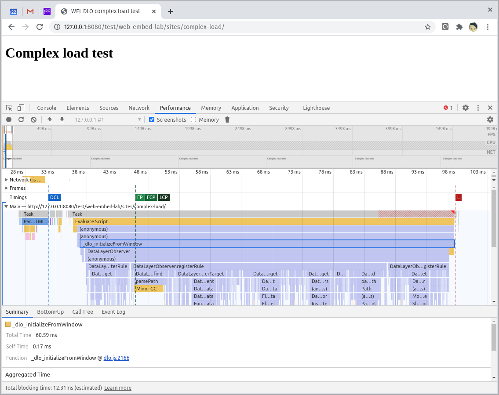
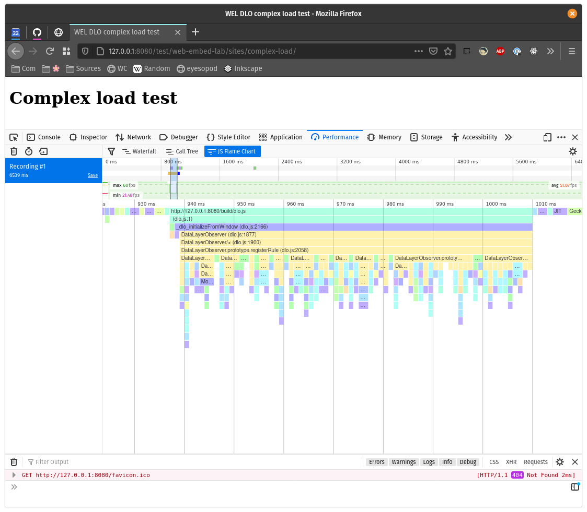

# Data Layer Observer Performance

We ran a few tests with Chrome and Firefox to see how DLO performs under load. In the [test/web-embed-lab/sites/ directory](https://github.com/fullstorydev/fullstory-data-layer-observer/tree/main/test/web-embed-lab/sites) you will find the `load` and `complex-load` pages that we used to gather these numbers.

In general, each DLO rule takes less than a tenth of a millisecond to initialize and run in both Chrome and Firefox.

These performance snapshots were taken on a standard desktop machine on September 22nd 2020. We pointed Chrome and Firefox at the `complex-load` test page which creates a large data layer source object and then creates 1000 rules of varying types. Most sites in production will have less than 100 rules, each less complex than these test rules. We wanted to test the worst case scenario.

### Chrome results

Average time to initialize and run a rule: 0.06 ms

Average memory per rule: 12 bytes

### Firefox results

Average time to initialize and run a rule: 0.07 ms

Average memory per rule: 16 bytes

