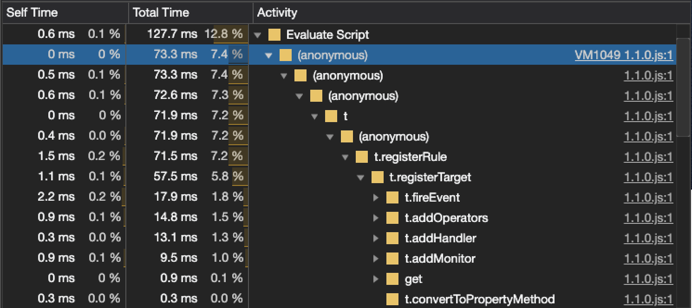

# Data Layer Observer Performance

<table>
    <tr><th>Script size</th><td>~8 kb</td></tr>
    <tr><th>Download time</th><td>~10 ms</td></tr>
    <tr><th>Rule registration</th><td>&lt; 0.1 ms</td></tr>
    <tr><th>1 rule test</th><td>~3 ms total time</td></tr>
    <tr><th>1,000 rule test</th><td>~60 ms total time</td></tr>
</table>

## Script

Data Layer Observer (DLO) when minified, gzipped is ~8 KB in size.  At FullStory, we host DLO from Google’s CDN, and download time in the United States is ~10 ms.  Since DLO can readOnLoad or watch for changes, lazy loading of the script is possible.  DLO does not need to be loaded immediately on the page, which helps improve page render metrics.

## Performance Test

The [test/web-embed-lab/sites/](https://github.com/fullstorydev/fullstory-data-layer-observer/tree/main/test/web-embed-lab/sites) directory contains “load” and “complex-load” pages used to run performance tests.

Performance snapshots were taken on a standard desktop machine on September 22, 2020. Both Chrome and Firefox were used with the “complex-load” test page.  This test creates a large data layer source object with 1,000 rules of varying types. Production websites will have far fewer rules - most likely less than 100 rules. The “complex-load” test suite provides a worst-case scenario in which all data layer objects are read on load and all rules are validated.

In general, each DLO rule takes less than a tenth of a millisecond to initialize and run in both Chrome and Firefox.

| Browser | Avg. Rule Time | Avg. Rule Memory |
| ------- | -------------- | ---------------- |
| Chrome | 0.06 ms | 12 bytes |
| Firefox | 0.07 ms | 16 bytes |

## Influencing Performance

While the “complex-load” performance test demonstrates adequate performance metrics for any production website, there are adjustments that can be made.

Upon execution, Data Layer Observer will register and process all rules defined on the page in four main steps:

1. Parse and validate the rule (registerRule)
1. Create DataHandlers (addHandler and addOperators)
1. Create DataMonitors (addMonitor)
1. Optionally read the current value from the data layer (fireEvent)

The following additional adjustments can be made:

- To prevent unnecessary creation of DataHandlers and DataMonitors, use the url property of a rule to define when a rule should be processed for a given page.
- If rules have been thoroughly tested, _dlo_validateRules can be set to false.
- Use the global readOnLoad configuration option only if you have a static data layer.  Each rule can have an individual readOnLoad option depending on the data layer’s behavior.
- Do not use previewMode set to true when conducting performance tests.  This will result in stringifying data and printing to the console leading to significant time in the fireEvent step.

